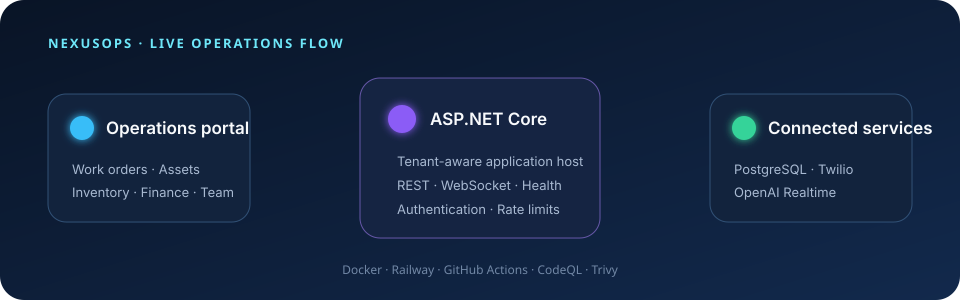

<div align="center">

# NexusOps

### Operations, assets and AI-assisted voice workflows in one secure platform

[](https://github.com/ChevCellios/NexusOps.VoiceWorker/actions/workflows/ci.yml)
[](https://github.com/ChevCellios/NexusOps.VoiceWorker/actions/workflows/codeql.yml)
[](https://nexusopsvoiceworker-production.up.railway.app/health)
[](https://dotnet.microsoft.com/)
[](https://www.postgresql.org/)
[](Dockerfile)

[**Open production**](https://nexusopsvoiceworker-production.up.railway.app/) · [Health status](https://nexusopsvoiceworker-production.up.railway.app/health) · [Security policy](SECURITY.md)



</div>

> [!IMPORTANT]
> The production portal requires configured access. The `/health` endpoint is public so Railway and external monitors can verify service readiness without exposing operational data.

NexusOps is a .NET 9 operations portal with an integrated voice-call service. It combines work-order, asset, inventory, finance, team, and customer-order workflows with Twilio telephony and an OpenAI Realtime audio bridge in one ASP.NET Core deployment.

Current release: **0.2.0-beta.1**. See [CHANGELOG.md](CHANGELOG.md) and [docs/UPGRADING.md](docs/UPGRADING.md) before upgrading a deployed installation.

The application supports PostgreSQL-backed, tenant-scoped data for deployment and in-memory stores for local development. Supabase Auth can be enabled for email/password sign-in and role-based access.

## Features

### Operations portal

- Dashboard with operational overview and priority work orders
- Work-order creation, assignment, status changes, activity history, labor, and material costs
- Asset registration, status, location, and linked work orders
- Inventory movements and warehouse transfers
- Customer orders with automatic work-order creation
- Finance, loans, public tenders, team presence, and employee views
- Filterable reports with UTF-8 CSV export
- Technician-specific **My Work Orders** view and work-time tracking
- Mock notification center that does not send real messages

### Voice service

- Outbound call initiation through the Twilio Calls API
- Twilio answer and status callbacks with signature validation
- Bidirectional Twilio Media Streams over WebSocket
- OpenAI Realtime audio bridge using G.711 μ-law, server VAD, and interruption handling
- Call-session persistence and ordered transcript storage in PostgreSQL
- Browser Realtime session endpoint and a local Command Center test interface
- JSON health endpoint and HTML service status page

> [!NOTE]
> The hosted `QueuedVoiceCallWorker` is currently a placeholder: queue polling is intentionally disabled. Calls can be initiated through the implemented HTTP flow.

## Technology

| Area | Implementation |
| --- | --- |
| Runtime | .NET 9, ASP.NET Core |
| Web UI | Razor Pages, Bootstrap |
| Database | PostgreSQL via Npgsql |
| Authentication | Optional Supabase Auth with cookie sessions |
| Telephony | Twilio Calls API and Media Streams |
| Voice AI | OpenAI Realtime API |
| Tests | xUnit |
| Delivery | Docker, GitHub Actions, Railway-ready configuration |

## Project structure

```text
.
├── Controllers/             # Voice, provider, browser-session, and admin endpoints
├── Diagnostics/             # Health and status responses
├── Persistence/             # In-memory and PostgreSQL voice repositories
├── Providers/Twilio/        # Outbound Twilio provider
├── Realtime/OpenAI/         # OpenAI Realtime clients
├── Security/                # Voice authorization and Twilio signature validation
├── WebSockets/              # Twilio media-stream handler
├── Workers/                 # Hosted queue worker placeholder
├── NexusOps.Web/            # Razor Pages operations portal and database scripts
├── NexusOps.Web.Tests/      # Operations, inventory, and order unit tests
├── wwwroot/                 # Voice Command Center static interface
├── Dockerfile
└── NexusOps.VoiceWorker.sln
```

The root `NexusOps.VoiceWorker` host references `NexusOps.Web` and serves the portal, voice API, WebSocket handler, and static Command Center from the same process.

## Getting started

### Prerequisites

- [.NET 9 SDK](https://dotnet.microsoft.com/download/dotnet/9.0)
- PostgreSQL only if you want persistent data
- Twilio and OpenAI credentials only if you want to place real voice calls

### Run locally with in-memory data

```powershell
git clone https://github.com/ChevCellios/NexusOps.VoiceWorker.git
cd NexusOps.VoiceWorker
dotnet restore NexusOps.VoiceWorker.sln --configfile NuGet.Config
$env:ASPNETCORE_ENVIRONMENT = "Development"
dotnet run --project NexusOps.VoiceWorker.csproj
```

Open the local URL printed by ASP.NET Core. Useful routes include:

| Route | Purpose |
| --- | --- |
| `/` | Operations dashboard |
| `/command-center` | Voice Command Center |
| `/health` | JSON readiness response (`GET` and `HEAD`) |
| `/status` | HTML service status |
| `/voice/media` | Twilio WebSocket endpoint; not a browser page |

The Development profile uses in-memory persistence unless a database connection is supplied. Data resets when the process stops.

## Configuration

Use .NET User Secrets for local development or environment variables in deployment. Nested configuration keys use double underscores as environment-variable separators.

Configuration key names are safe to document. Their real values are not: keep passwords, tokens, connection strings, and provider credentials only in User Secrets or Railway Variables. Every `YOUR_...` value below is a placeholder and must never be replaced with a real secret in a committed file. The Supabase publishable/anon key is intended for client identification, but the service-role key is privileged and must never be used here.

```powershell
dotnet user-secrets set "ConnectionStrings:NexusOps" "Host=localhost;Port=5432;Database=nexusops;Username=postgres;Password=YOUR_PASSWORD" --project NexusOps.VoiceWorker.csproj
dotnet user-secrets set "NexusOps:TenantId" "YOUR_TENANT_UUID" --project NexusOps.VoiceWorker.csproj
dotnet user-secrets set "OpenAI:ApiKey" "YOUR_OPENAI_API_KEY" --project NexusOps.VoiceWorker.csproj
dotnet user-secrets set "Twilio:AccountSid" "YOUR_TWILIO_ACCOUNT_SID" --project NexusOps.VoiceWorker.csproj
dotnet user-secrets set "Twilio:AuthToken" "YOUR_TWILIO_AUTH_TOKEN" --project NexusOps.VoiceWorker.csproj
```

Key settings:

| Key | Purpose |
| --- | --- |
| `Persistence__Provider` | `InMemory` or `PostgreSql` |
| `ConnectionStrings__NexusOps` | PostgreSQL connection string |
| `NexusOps__TenantId` | Tenant UUID used to scope portal data |
| `OpenAI__ApiKey` | OpenAI API credential |
| `OpenAI__RealtimeModel` | Realtime model name |
| `Twilio__AccountSid` | Twilio account identifier |
| `Twilio__AuthToken` | Twilio credential and webhook-validation secret |
| `Twilio__FromPhoneNumber` | Caller number owned by the Twilio account |
| `Twilio__PublicBaseUrl` | Public HTTPS origin used for Twilio callbacks |
| `Twilio__MediaStreamUrl` | Public `wss://.../voice/media` URL |
| `SupabaseAuth__Enabled` | Enables Supabase sign-in support |
| `SupabaseAuth__RequireAuthenticatedUsers` | Requires authentication for portal pages |
| `SupabaseAuth__Url` | Supabase project URL |
| `SupabaseAuth__PublishableKey` | Publishable/anon key, never a service-role key |

The repository also supports ignored local files named `nexusops.connection.local.txt`, `openai.key.local.txt`, and `twilio.local.txt`. Do not commit or share them. Placeholder values in `appsettings.json` are not working credentials.

## Database setup

For a PostgreSQL/Supabase deployment, apply the scripts in `NexusOps.Web/Database` in this order:

1. `001_operations_schema.sql`
2. `002_user_access.sql`
3. `003_finance_and_tenders.sql`
4. `004_corporate_operations.sql`
5. `006_finance_schema_compatibility.sql` only when upgrading an older `loans` table
6. `005_adria_dynamics_demo_seed.sql` if you want the fictional demo dataset
7. `007_customer_order_automation.sql`
8. `008_work_order_labor.sql`
9. `009_rls_baseline.sql`
10. `010_public_demo_access.sql` if you want the restricted public demo user
11. `011_employee_auth_link.sql` for existing employees who need the technician view

Read each script before applying it. The compatibility, demo-access, and employee-link scripts contain scenario-specific guidance and placeholders. The Adria Dynamics seed is fictional and repeatable.

Future schema changes are applied automatically from `Database/Migrations`. The runner records each migration and checksum in `nexusops_schema_migrations`, uses a PostgreSQL advisory lock, and runs each file in a transaction. Disable it with `DatabaseMigrations__Enabled=false` only if migrations are managed separately. Never modify a migration after deployment.

### Authentication and roles

Authentication is off by default. After applying `002_user_access.sql`, create users in Supabase Auth and map them to NexusOps roles. Implemented roles are:

- `Viewer` — read-only portal access
- `Technician` — assigned-work view and permitted work-order status updates
- `Manager` — operational record creation and editing
- `Administrator` — full management access
- `Demo` — restricted access to the fictional demo flow

`009_rls_baseline.sql` enables RLS and removes direct client access to business tables. The portal accesses PostgreSQL through the backend, which applies tenant and role checks.

## Voice-call flow

```text
Client → Voice API → Twilio Calls API
                       ↓
              answer/status callbacks
                       ↓
Twilio Media Stream ↔ /voice/media ↔ OpenAI Realtime
                       ↓
             PostgreSQL sessions/transcripts
```

Twilio callback validation depends on the exact externally visible `Twilio:PublicBaseUrl`. In production, use HTTPS/WSS URLs and never expose provider secrets in browser code.

## Testing

```powershell
dotnet test NexusOps.VoiceWorker.sln --configuration Release
```

The current xUnit suite covers the in-memory operations, inventory, and customer-order stores. GitHub Actions restores dependencies, builds the solution, runs the tests, and verifies that the Docker image builds on pushes and pull requests targeting `main`.

## Docker and Railway

Build and run the included multi-stage image:

```powershell
docker build -t nexusops .
docker run --rm -p 8080:8080 --env-file .env nexusops
```

For Railway, copy the keys from `railway.variables.example.txt` into the service's Variables settings and replace every placeholder. The app binds to `0.0.0.0:$PORT`; configure `/health` as the health-check path and set the Twilio public URLs after Railway assigns a public domain.

The repository's GitHub Actions workflow validates the application but does not deploy it. Deployment can be handled by Railway's GitHub integration after CI succeeds.

Tags matching the application version, such as `v0.2.0-beta.1`, trigger the release workflow and create a GitHub prerelease artifact. Use a separate Railway staging service and database before promoting the same tag to production; rollback instructions are in [docs/UPGRADING.md](docs/UPGRADING.md).

## Security notes

- Never commit database passwords, OpenAI keys, Twilio tokens, or Supabase service-role keys.
- Keep authentication enabled for non-demo production deployments.
- Configure the exact public callback origin so Twilio signature validation succeeds.
- Treat transcript and operational data as sensitive application data.
- Production startup is fail-closed: authentication, tenant, database, provider signatures, secure callback URLs, and a concrete `AllowedHosts` value are mandatory.
- Voice-call management requires an authenticated Manager or Administrator and verifies that the call belongs to the configured tenant.
- Rate limits protect login, voice, browser Realtime, and general request traffic; Twilio media streams also have concurrency and duration limits.
- See [SECURITY.md](SECURITY.md) for the deployment requirements and private vulnerability-reporting process.
