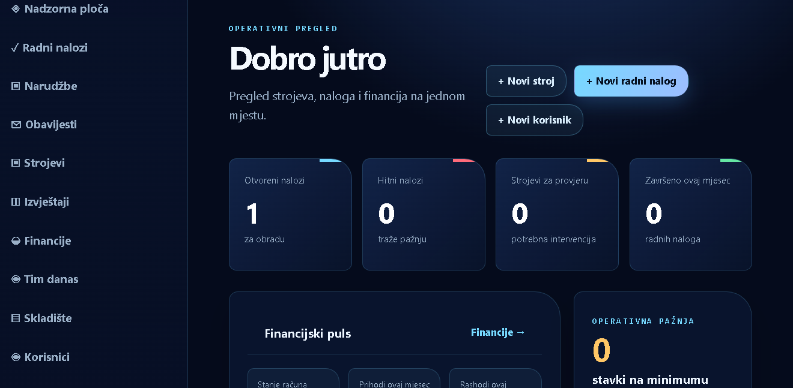

# ⚙️ NexusOps

[](https://nexusopsvoiceworker-production.up.railway.app/)

[](https://github.com/ChevCellios/NexusOps.VoiceWorker/actions/workflows/ci.yml)
[](https://github.com/ChevCellios/NexusOps.VoiceWorker/actions/workflows/codeql.yml)
[](https://nexusopsvoiceworker-production.up.railway.app/health)
[](https://dotnet.microsoft.com/)
[](https://www.postgresql.org/)
[](https://opentelemetry.io/)
[](Dockerfile)
[](LICENSE)

NexusOps je .NET 10 LTS platforma za upravljanje operacijama, imovinom, zalihama, financijama i terenskim radom. U istom sigurnom ASP.NET Core sustavu povezuje PostgreSQL poslovne podatke s Twilio telefonijom i OpenAI Realtime glasovnim tokom.

Trenutačna verzija: **0.2.0-beta.1**. Prije nadogradnje produkcije provjeri [CHANGELOG](CHANGELOG.md) i [vodič za nadogradnju](docs/UPGRADING.md).

## 🔗 Produkcija i demo

- [NexusOps produkcija](https://nexusopsvoiceworker-production.up.railway.app/)
- [Javni demo](https://nexusopsvoiceworker-production.up.railway.app/Demo)
- [Readiness provjera](https://nexusopsvoiceworker-production.up.railway.app/health)
- [Sigurnosna politika](SECURITY.md)

> [!IMPORTANT]
> Produkcijski portal i Voice Command Center zahtijevaju odgovarajuću korisničku ulogu. Neprijavljeni korisnici dobivaju jasnu poveznicu prema demo načinu ili prijavi umjesto generičke 404 stranice.

## ✨ Značajke

### Operativni portal

- pregled aktivnih i prioritetnih radnih naloga
- izrada, dodjela, statusi, povijest aktivnosti, radni sati i materijalni troškovi
- registar imovine s lokacijom, statusom i povezanim radnim nalozima
- skladišna kretanja, zalihe i prijenosi između lokacija
- korisničke narudžbe s automatskim stvaranjem radnih naloga
- financije, krediti, javni natječaji, prisutnost tima i zaposlenici
- filtrirani izvještaji i UTF-8 CSV izvoz
- zaseban prikaz **Moji radni nalozi** za tehničare
- tenant izolacija i role `Viewer`, `Technician`, `Manager`, `Administrator` i `Demo`

### AI glasovni servis

- pokretanje izlaznih poziva preko Twilio Calls API-ja
- potpisani Twilio answer i status callbackovi
- dvosmjerni Twilio Media Streams preko WebSocketa
- OpenAI Realtime audio bridge s G.711 μ-law zvukom, server VAD-om i prekidima govora
- PostgreSQL sesije poziva i uređeni transkripti
- durable red s `FOR UPDATE SKIP LOCKED`, lease mehanizmom, retry politikom i dead-letter stanjem
- Voice Command Center i browser Realtime session endpoint
- zaštita od dvostrukog pokretanja i monotoni prijelazi statusa poziva

## 📸 Screenshot



Nadzorna ploča objedinjuje radne naloge, strojeve, financijski puls i operativna upozorenja u responzivnom tamnom sučelju.

## 🔄 Tok platforme


1. Portal prima korisničku akciju i provjerava tenant, ulogu i rate limit.
2. PostgreSQL transakcijski sprema poslovne podatke ili voice posao.
3. Worker sigurno preuzima jedan voice posao pomoću `FOR UPDATE SKIP LOCKED`.
4. Twilio pokreće poziv i vraća potpisane callbackove.
5. Media Stream povezuje poziv s OpenAI Realtime audio sesijom.
6. OpenTelemetry povezuje HTTP zahtjev, queue obradu, WebSocket i vanjske API pozive istim correlation ID-em.

## 🛡️ Sigurnost i privatnost

- Supabase Auth s cookie sesijama i osvježavanjem aktivne korisničke uloge
- tenant i role provjere za portal, API i upravljanje pozivima
- Twilio signature validation za webhook i media tok
- obavezni HTTPS/WSS callback URL-ovi u produkciji
- rate limiting za prijavu, voice API, browser Realtime i opći promet
- ograničenja trajanja i konkurentnosti Media Stream sesija
- zaštita povratnih URL-ova i ograničenje veličine Realtime zahtjeva
- produkcijski fail-closed startup za obaveznu bazu, autentikaciju i provider postavke
- NuGet audit, CodeQL analiza i Trivy provjera Docker imagea
- tajne se učitavaju iz User Secrets ili deployment varijabli, nikada iz repozitorija

## 🧯 Pouzdanost i nadzor

- timeout i circuit breaker za OpenAI i Supabase HTTP klijente
- retry samo za sigurne zahtjeve; Twilio start nema automatski HTTP retry bez idempotency zaštite
- Twilio `429 Too Many Requests` u redu koristi ograničeni eksponencijalni retry
- neodređene provider greške prelaze u `dead_letter` kako se ne bi ponovio naplativi poziv
- `X-Correlation-ID` kroz zahtjeve, logove i OpenTelemetry aktivnosti
- OTLP izvoz traceova i metrika prema kompatibilnom observability backendu
- javni `/health` readiness endpoint i administratorski `/status`

Queue metrike uključuju `nexusops.voice.queue.completed`, `nexusops.voice.queue.retried` i `nexusops.voice.queue.dead_lettered`. Vlastiti spanovi uključuju `voice.queue.process` i `voice.realtime.bridge`.

## 🔁 CI/CD i Dependabot

GitHub Actions na svakom pull requestu i pushu u `main` izvršava:

1. restore i NuGet security audit
2. Release build
3. xUnit i PostgreSQL Testcontainers testove
4. Docker build i Trivy provjeru
5. CodeQL analizu C# koda

Zaštićeni `main` zahtijeva uspješne provjere `Build and verify` i `analyze`. Dependabot tjedno provjerava NuGet, GitHub Actions i Docker ovisnosti; patch i minor nadogradnje automatski se squash-mergeaju tek nakon prolaska obaveznih provjera. Major nadogradnje ostaju za ručni pregled.

## ✅ Testiranje

Testovi pokrivaju operativne storeove, autorizaciju, lifecycle poziva, callback zaštitu, migracije, tenant izolaciju, konkurentne queue claimove, retry i dead-letter prijelaze.

```powershell
dotnet restore NexusOps.VoiceWorker.sln --configfile NuGet.Config
dotnet build NexusOps.VoiceWorker.sln --configuration Release --no-restore
dotnet test NexusOps.VoiceWorker.sln --configuration Release --no-build
```

Za PostgreSQL integracijske testove potreban je Docker:

```powershell
$env:RUN_POSTGRES_INTEGRATION_TESTS = "1"
dotnet test NexusOps.VoiceWorker.sln --configuration Release
```

## ⚙️ Tehnologije

| Područje | Tehnologije |
| --- | --- |
| Runtime | .NET 10 LTS, ASP.NET Core, C# |
| Sučelje | Razor Pages, Bootstrap, JavaScript |
| Podaci | PostgreSQL, Npgsql, automatske SQL migracije |
| Identitet | Supabase Auth, cookie sesije, role i tenant provjere |
| Telefonija | Twilio Calls API i Media Streams |
| Voice AI | OpenAI Realtime API |
| Pouzdanost | `Microsoft.Extensions.Http.Resilience`, durable PostgreSQL queue |
| Observability | OpenTelemetry traces, metrics, correlation ID i OTLP |
| Testovi | xUnit i Testcontainers for .NET |
| Isporuka | Docker, GitHub Actions i Railway |

## 🚀 Pokretanje lokalno

### Preduvjeti

- [.NET 10 SDK](https://dotnet.microsoft.com/download/dotnet/10.0)
- PostgreSQL samo za trajnu pohranu i integracijske testove
- Twilio i OpenAI vjerodajnice samo za stvarne voice pozive

### In-memory razvoj

```powershell
git clone https://github.com/ChevCellios/NexusOps.VoiceWorker.git
cd NexusOps.VoiceWorker
dotnet restore NexusOps.VoiceWorker.sln --configfile NuGet.Config
$env:ASPNETCORE_ENVIRONMENT = "Development"
dotnet run --project NexusOps.VoiceWorker.csproj
```

Development profil bez Supabase autentikacije koristi lokalni `Administrator` identitet. In-memory podaci brišu se nakon zaustavljanja procesa.

| Ruta | Namjena |
| --- | --- |
| `/` | Operativna nadzorna ploča |
| `/Demo` | Ograničeni javni demo |
| `/command-center` | Role-protected Voice Command Center |
| `/health` | Javni JSON readiness odgovor |
| `/status` | Administratorski status servisa |
| `/voice/media` | Twilio WebSocket endpoint |

### Docker

```powershell
docker build --tag nexusops .
docker run --rm --publish 8080:8080 --env-file .env nexusops
```

Railway postavlja `PORT`; za health-check koristi `/health`. Primjer deployment varijabli nalazi se u `railway.variables.example.txt`.

<details>
<summary><strong>Konfiguracija i tajne</strong></summary>

Koristi .NET User Secrets lokalno ili environment varijable u deploymentu. Dvotočke iz .NET ključeva u environment varijablama zamjenjuju se dvostrukom donjom crtom.

```powershell
dotnet user-secrets set "ConnectionStrings:NexusOps" "Host=localhost;Port=5432;Database=nexusops;Username=postgres;Password=YOUR_PASSWORD" --project NexusOps.VoiceWorker.csproj
dotnet user-secrets set "NexusOps:TenantId" "YOUR_TENANT_UUID" --project NexusOps.VoiceWorker.csproj
dotnet user-secrets set "OpenAI:ApiKey" "YOUR_OPENAI_API_KEY" --project NexusOps.VoiceWorker.csproj
dotnet user-secrets set "Twilio:AccountSid" "YOUR_TWILIO_ACCOUNT_SID" --project NexusOps.VoiceWorker.csproj
dotnet user-secrets set "Twilio:AuthToken" "YOUR_TWILIO_AUTH_TOKEN" --project NexusOps.VoiceWorker.csproj
```

| Ključ | Namjena |
| --- | --- |
| `Persistence__Provider` | `InMemory` ili `PostgreSql` |
| `ConnectionStrings__NexusOps` | PostgreSQL connection string |
| `NexusOps__TenantId` | Tenant UUID |
| `OpenAI__ApiKey` | OpenAI API vjerodajnica |
| `Twilio__AccountSid` / `Twilio__AuthToken` | Twilio račun i webhook validacija |
| `Twilio__PublicBaseUrl` | Javni HTTPS origin callbackova |
| `Twilio__MediaStreamUrl` | Javni `wss://.../voice/media` URL |
| `OTEL_EXPORTER_OTLP_ENDPOINT` | Opcionalni OTLP collector endpoint |
| `VoiceCallQueue__Enabled` | Uključuje durable PostgreSQL queue |
| `VoiceCallQueue__PollIntervalSeconds` | Poll interval; zadano `2` sekunde |
| `VoiceCallQueue__LeaseMinutes` | Trajanje leasea; zadano `5` minuta |
| `VoiceCallQueue__MaxAttempts` | Najviše pokušaja; zadano `4` |
| `SupabaseAuth__Enabled` | Uključuje Supabase prijavu |
| `SupabaseAuth__RequireAuthenticatedUsers` | Zahtijeva prijavu za portal |

</details>

<details>
<summary><strong>PostgreSQL i migracije</strong></summary>

Početne skripte iz `NexusOps.Web/Database` primjenjuju se prema numeraciji i uputama u datotekama. Scenarijske skripte za kompatibilnost, demo pristup i povezivanje zaposlenika treba pregledati prije izvršavanja.

Buduće promjene automatski se primjenjuju iz `Database/Migrations`. Runner koristi PostgreSQL advisory lock, transakcije i checksum zapise u `nexusops_schema_migrations`. Migracija `005_voice_call_queue.sql` dodaje durable voice red. Već primijenjene migracije ne treba mijenjati.

</details>

## 📁 Struktura projekta

```text
NexusOps.VoiceWorker/
├── .github/                  # CI, CodeQL, release i Dependabot workflowi
├── Controllers/              # Voice, provider, browser i admin endpointi
├── Database/Migrations/      # Automatske aplikacijske migracije
├── Diagnostics/              # Health, status, tracing i metrike
├── Persistence/              # Sesije, transkripti i durable queue
├── Providers/Twilio/         # Twilio outbound provider
├── Realtime/OpenAI/          # OpenAI Realtime klijenti
├── Security/                 # Autorizacija i signature validation
├── WebSockets/               # Twilio Media Stream bridge
├── Workers/                  # PostgreSQL voice queue worker
├── NexusOps.Web/             # Razor Pages operativni portal
├── NexusOps.Web.Tests/       # Unit i PostgreSQL integracijski testovi
├── docs/                     # Vizuali i vodič za nadogradnju
├── Dockerfile
└── NexusOps.VoiceWorker.sln
```

## 🗺️ Moguća buduća poboljšanja

- produkcijski dashboard i alerting za OpenTelemetry signale
- browser/E2E testovi za portal, demo i Voice Command Center
- izvještaj o pokrivenosti testovima i periodično mjerenje performansi
- dodatne idempotency zaštite za provider operacije
- proširenje tenant administracije i audit traila

## 🤝 Doprinosi i povratne informacije

Prijave grešaka i obrazloženi prijedlozi dobrodošli su kroz [GitHub Issues](https://github.com/ChevCellios/NexusOps.VoiceWorker/issues). Prije većih izmjena otvori Issue kako bi se dogovorili opseg i sigurnosni utjecaj.

## 🔐 Sigurnosne prijave

Moguće ranjivosti nemoj objavljivati kroz javni Issue. Prijavi ih privatno prema [sigurnosnoj politici projekta](SECURITY.md).

## 📄 Licenca

Projekt je objavljen pod [MIT licencom](LICENSE). Dopušteni su korištenje, izmjene i distribucija uz zadržavanje obavijesti o autorskim pravima i teksta licence.

## 📬 Kontakt

- GitHub: [ChevCellios](https://github.com/ChevCellios)
- Pitanja i prijedlozi: [GitHub Issues](https://github.com/ChevCellios/NexusOps.VoiceWorker/issues)
